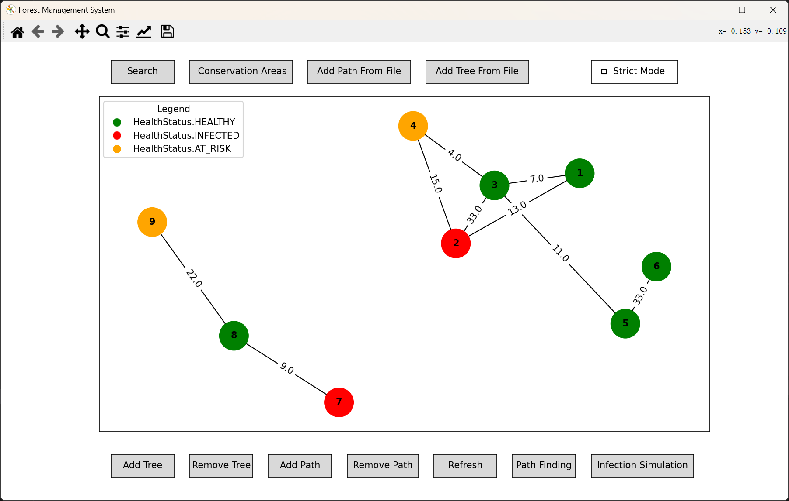
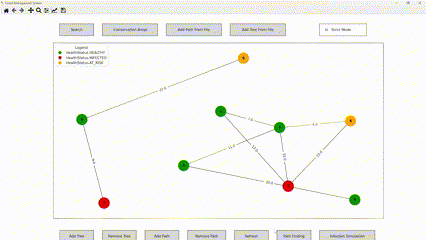
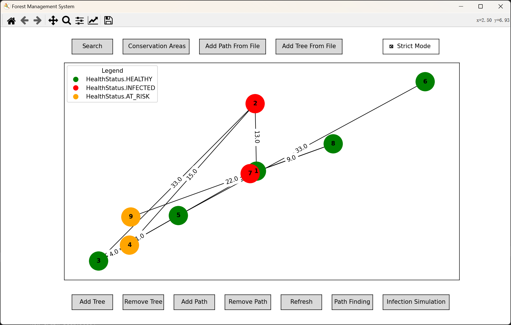

# Forest_Management_System
Efrei course assignment

## Display
2024/7/3 version
You can check our feature design sources on this website
[Project 1 - Forest Management System](https://stealth-jodhpur-ff1.notion.site/Project-1-Forest-Management-System-f9f6a728bf814a8ea2b938bd10cf5993)
All of these functions have been implemented, and some of them have not been reflected in the interface yet. Only console output is supported, and we will improve it in the next few days.

##
```
Forest_Management_System/
│
├── README.md            # Main readme file with project description and instructions
├── LICENSE             # Project license file
│
├── .gitignore          # Specifies intentionally untracked files to ignore
│
├── main.py             # Main execution script for the project
│
├── requirements.txt    # List of all the project dependencies
│
├── src/                # Source code directory
│   ├── __init__.py     # Package initialization file
│   ├── forest_management_system/ # Subpackage for the main project modules
│   │   ├── __init__.py   # Subpackage initialization file
│   │   ├── tree.py       # Class definition for tree nodes
│   │   ├── path.py       # Class definition for paths between trees
│   │   ├── forest.py     # Class definition for the forest graph
│   │   ├── health_status.py # Enumeration for health status
│   │   └── simulation.py # Infection spread simulation logic
│   └── utils/           # Utility functions and classes
│       ├── __init__.py # Utility package initialization file
│       └── ...          # Additional utility modules as needed
│
├── tests/              # Test scripts and test cases
│   ├── __init__.py     # Package initialization file for tests
│   ├── test_tree.py    # Test cases for the Tree class
│   ├── test_path.py    # Test cases for the Path class
│   ├── test_forest.py  # Test cases for the Forest class
│   └── ...             # Additional test modules as needed
│
├── docs/               # Documentation related to the project
│   ├── index.md         # Main documentation page
│   ├── design.md        # Documentation on the design of the project
│   ├── user_guide.md    # User guide for using the application
│   └── ...             # Additional documentation files as needed
│
├── gui/                # Graphical User Interface related code
│   ├── __init__.py     # Package initialization file for GUI
│   ├── main_window.py  # Code for the main GUI window
│   ├── tree_management.py # GUI components for managing trees
│   ├── path_finding.py # GUI components for path finding
│   ├── infection_spread.py # GUI components for infection spread simulation
│   └── ...            # Additional GUI modules as needed
│
└── data/               # Directory for any data files used by the project
    ├── raw/            # Directory for raw data files
    ├── processed/      # Directory for processed data files
    └── ...             # Additional data related directories as needed
```
## Main Interface:



## Installation Guide 

1. Download all the source files from the main branch of the [Forest_Management_System](https://github.com/Yanntez/Forest_Management_System) repository.

2. Open this folder in VSCode and install the Python extension (recommended version: Python 3.10+).

3. Download the required libraries to run the program. Specifically:

   ① Install the necessary libraries `networkx` and `matplotlib`. If needed, use the following pip command in the terminal:
   ```
   pip install networkx matplotlib
   ```
   ② Other libraries (most are included with Python, but if any are missing, you can download them): `copy`, `threading`, `time`, `numpy` (included in Python 3.7+), `tkinter`, `enum`, `heapq`, `collections`.

4. Start the program by running the ``main.py`` file.


## Primary Data Structures

We utilize Python classes to represent individual trees in a forest and the paths between them. Each tree possesses attributes such as tree ID, species, age, and health status. The health status is defined using an enumeration type `HealthStatus`, ensuring the validity and consistency of status values.

1. **Tree Node Representation**: Implemented with the `Tree` class, which includes attributes such as tree ID, species, age, and health status, ensuring `health_status` is an instance of the `HealthStatus` enumeration.

2. **Health Status Representation**: Defined using the `HealthStatus` enumeration class to ensure the validity and consistency of health status values.

3. **Path Representation**: The `Path` class represents weighted undirected paths between two trees in the forest.

4. **Graph Representation**: The `Forest` class implements the data structure of the forest as an undirected graph, containing a collection of trees and a set of paths connecting these trees. It provides functionalities for adding and removing trees and paths, updating path distances, and updating the health status of trees.

## Identifying Conservation Areas

The code implements a method called find_conservation_areas to identify connected clusters of healthy trees in the forest, which are considered potential conservation areas. It traverses the forest's graph structure using the Depth-First Search (DFS) algorithm, recording the visited trees to avoid duplication, and collects the IDs of healthy trees to form conservation areas. Ultimately, the method returns a list containing all potential conservation areas, with each area being a subset representing the IDs of healthy trees.

## Infection Spread Simulation

We implemented an infection spread simulation feature. This feature, based on the Breadth-First Search (BFS) algorithm, can accurately simulate the spread of infection among trees in a forest.

In each step of the simulation, it starts by identifying all currently infected trees. These trees become the starting points for the spread process. Initially, an infection queue is created and populated with the IDs of the initially infected trees. At the same time, a set is created to track visited trees, and the propagation rounds are initialized.

During the simulation, if the queue becomes empty, indicating that there are no more trees to process, the forest is rechecked to determine if there are any previously undiscovered sources of infection. If new infected trees are found, the simulation continues.

In each propagation round, the simulation will:
- Increase the propagation round count and print the current round.
- Remove a tree's ID from the queue and check all paths connected to it, looking for unvisited neighboring trees.
- If the neighboring trees are not yet infected, update their status to infected, add them to the visited set, and place them in the queue for the next round of processing.

The code uses class attributes to store the queue, the visited set, and the propagation rounds used during the process. This ensures continuity of state across multiple calls to the `spread_infection` method, thereby allowing the complete display of the infection simulation process in a graphical user interface. If new sources of infection are discovered during the simulation, the propagation process is re-triggered to ensure all infections are identified and processed. If the queue is still empty at the end of a propagation round, it indicates that there are no more trees to process, and the simulation ends.

## Path Finding

This code implements Dijkstra's algorithm to calculate the shortest path between a given start tree and an end tree. By initializing the distances of all nodes to infinity and setting the distance of the start tree to 0, the algorithm uses a priority queue to progressively select the node with the current shortest distance and update the distances and parent nodes of its neighboring nodes.

- When the end tree is selected, the code backtracks to construct the complete shortest path and returns the shortest distance and the path. If no path is reachable, it returns infinity and an empty path.

## Graphical Interface

This section of code is a GUI application for a forest management system, allowing users to manage the forest in various interactive ways. The application offers the following main features:

1. **Tree Management**: Includes buttons for adding and removing trees. Users can perform these operations by clicking the corresponding buttons. When adding a tree, a dialog box prompts the user to enter the tree's relevant information; when removing a tree, the user needs to input the ID of the tree to be removed.

2. **Path Finding**: Implements Dijkstra's algorithm. Users can click a button to bring up a dialog box where they can enter the IDs of two trees to find and display the shortest path between them.

3. **Infection Spread Simulation**: Simulate the spread of infection in a forest using multithreading, allowing the user to specify the infection speed. After the infection starts, the program will perform a `Breadth-First-Search` infection at the speed specified by the user. When the simulation ends, the final infection state will be maintained for a short period before the image is restored.

**Eventually Manifested**:



4. **Search**: After user clicking the `Search` button, a dialog box appears for the user to enter the species name. If there are corresponding trees in the diagram, their information will be displayed.

5. **Conservation Area**: After clicking the `Conservation Area` button, the program will group healthy and interconnected trees into multiple protected areas and display them through a dialog box.

6. **Add Paths and Trees from File**:
After clicking `Add Path from File` and `Add Tree from File` buttons, users can select and import CSV files to add paths and trees, which will be displayed on the current diagram.

Additionally, the graphical interface includes the following features:

- **Refresh View**: Allows users to refresh the graphical view to show the latest state of the forest.
- **Zoom and Pan**: Implements zooming and panning through mouse wheel events to enhance user experience.
- **Strict Mode**: After enabling strict mode, the diagram will be drawn as accurately as possible according to the actual path lengths, with flexible adjustments in case of conflicts. (**Note:** Enabling this mode may reduce the visibility of the diagram.)
- **Interactive operation**: When the user hovers the mouse over a tree node, it will display the tree's species, age, and health information.

**Strict Mode Manifestation**:



### Challenges & Overcoming

**Infection Simulation:**

During the infection spread, the infection queue is used to manage the spread process. In each round of infection, if an uninfected tree is found adjacent to the currently processed infected tree, the ID of this uninfected tree will be added to the infection queue. This leads to a challenge: since the traversal and infection are processed one by one, if an infected tree has multiple adjacent uninfected trees, only the first tree in the infection queue will be infected. When processing the next infection node, if the other trees in the previous queue are not adjacent to it, they will not be infected.

Therefore, we added a layer of logic: if the current infected tree detects no adjacent uninfected trees, it will perform a second check for any uninfected trees. If there are any, it will backtrack the infection queue to ensure the infection process is completed comprehensively.
