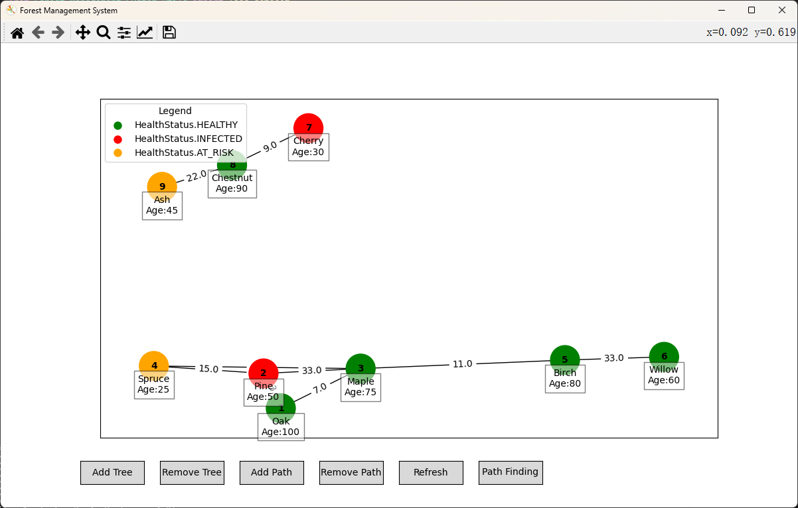
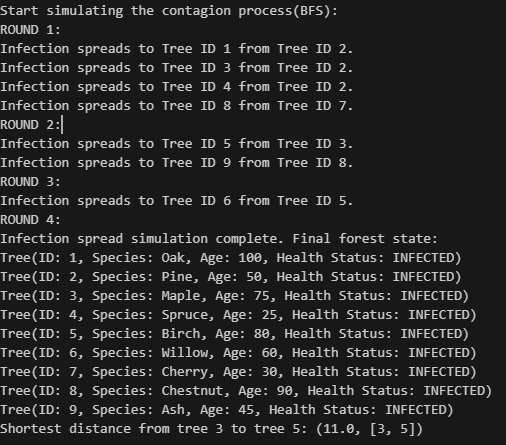

# Forest_Management_System
Efrei course assignment

#  Display
2024/6/28 version
You can check our feature design sources on this website
https://stealth-jodhpur-ff1.notion.site/Project-1-Forest-Management-System-f9f6a728bf814a8ea2b938bd10cf5993
All of these functions have been implemented, and some of them have not been reflected in the interface yet. Only console output is supported, and we will improve it in the next few days.

# Forest Management System Mid-term Report

## Primary Data Structures
We utilize Python classes to represent individual trees in a forest and the paths between them. Each tree possesses attributes such as tree ID, species, age, and health status. The health status is defined using an enumeration type `HealthStatus`, ensuring the validity and consistency of status values.

- **Tree Node Representation**: Implemented with the `Tree` class, which includes methods to ensure `health_status` is an instance of the `HealthStatus` enumeration.
- **Path Representation**: The `Path` class represents weighted undirected paths between two trees in the forest.
- **Graph Representation**: The `Forest` class implements the data structure of the forest as an undirected graph, containing a collection of trees and a set of paths connecting these trees.

## Undirected Graph Drawing
The code uses the NetworkX and Matplotlib libraries to create a graphical representation of trees and their paths in a forest.
- It creates a graph object, adds tree nodes and path edges.
- Uses a spring layout to determine node positions.
- Colors nodes based on tree health status.
- Annotates detailed information.
- Finally, outputs the corresponding undirected graph of the forest.

## Infection Spread Simulation
We have successfully implemented the simulation of infection spread. This functionality is based on the Breadth-First Search (BFS) algorithm, accurately modeling how infection spreads among trees in a forest.

- The simulation begins by identifying all initially infected trees. These trees serve as the starting points for the spread.
- Subsequently, the system enters a loop where each iteration represents one cycle of infection propagation.
- We defined an `Infect` class that includes a static method `spread_infection`, which takes a forest object as a parameter. This method performs the following tasks:
  1. **Initialization**: Records the number of propagation cycles and identifies all initially infected trees, storing their IDs in a queue. It also creates a set to track visited trees.
  2. **Breadth-First Search**: Uses a queue to simulate the BFS process. During each propagation cycle, the system checks each tree in the queue and traverses all its connected paths to find adjacent trees that haven't been visited.
  3. **Infection Spread**: For each adjacent tree that hasn't been visited and isn't already infected (`INFECTED`), the system updates its health status to `INFECTED` and adds it to the queue for the next propagation cycle.
  4. **Output Results**: After completing all propagation cycles, the system outputs the final state of the forest, including the health status of each tree.

## Path Finding
This code implements Dijkstra's algorithm to calculate the shortest path between a given start tree and an end tree. By initializing the distances of all nodes to infinity and setting the distance of the start tree to 0, the algorithm uses a priority queue to progressively select the node with the current shortest distance and update the distances and parent nodes of its neighboring nodes.

- When the end tree is selected, the code backtracks to construct the complete shortest path and returns the shortest distance and the path. If no path is reachable, it returns infinity and an empty path.

## Graphical Interface
This code is a GUI application for a forest management system, utilizing the Tkinter library to create a user interface that allows users to manage forests interactively. The application provides the following main functionalities:

1. **User Interface Design**: Utilizes the Tkinter library to create a main window with buttons and dialogs for user interaction.
2. **Tree Management Features**: Includes buttons for adding and deleting trees, enabling users to perform corresponding actions by clicking these buttons. When adding a tree, a dialog prompts the user to enter relevant tree information. When deleting a tree, the user is prompted to enter the ID of the tree to be removed.

## Future Plans
Expand extra features, additional functionalities such as data analysis, graphical interaction, visualization of infection simulations, etc.